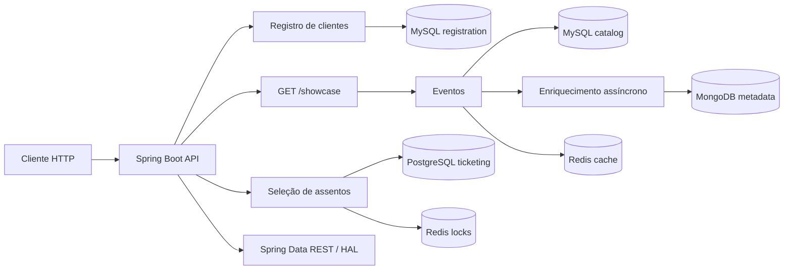

# Marketplace

Backend de cadastro de clientes, catálogo de eventos e seleção de assentos, construído com Spring Boot. O módulo de registro persiste clientes no MySQL; o catálogo usa outro MySQL e MongoDB; ticketing usa PostgreSQL para eventos, setores e assentos e Redis para bloqueios temporários de assentos.

## Funcionalidades

### Cadastro de clientes

- Exposição dos clientes por meio do Spring Data REST, com paginação e ordenação.
- Busca por prefixo do primeiro nome, sem diferenciar maiúsculas e minúsculas.
- Projeção HAL `except`, com primeiro nome, sobrenome e endereço.
- Associação um-para-um entre cliente e endereço; salvar o cliente também persiste o endereço.
- Validação de primeiro nome obrigatório e e-mail obrigatório com formato válido.
- Registro de eventos de criação, atualização e exclusão de clientes.
- Exclusão direta por `deleteById` desabilitada na API REST.

### Catálogo de eventos

- Persistência dos eventos em um banco MySQL separado do banco de clientes.
- Persistência de descrições, requisitos técnicos, setores e assentos no MongoDB, associados ao evento por UUID.
- Enriquecimento assíncrono dos eventos com seus metadados usando `@Async` e `CompletableFuture`.
- Endpoint `GET /showcase` que retorna eventos em DTOs com metadados e assentos agrupados por setor.
- Repositórios de eventos e metadados publicados pelo Spring Data REST em formato HAL.
- Registro de eventos de criação, atualização e exclusão de eventos nos logs.

### Ticketing

- Consumo assíncrono dos eventos de criação de clientes e atualização de eventos publicados pela aplicação.
- Persistência de eventos, setores e assentos no PostgreSQL.
- Endpoint `POST /ticketing/events/{eventId}/seats/select` para solicitar a seleção de um assento.
- Verificação de que o assento pertence ao evento antes de tentar reservá-lo.
- Bloqueio temporário no Redis por evento e assento, com expiração após 30 segundos.

### Operação

- Endpoint de saúde disponível em `/actuator/health`.
- Diagramas Mermaid podem ser visualizados em um visualizador Markdown compatível; não é necessária dependência Mermaid no backend.

## Arquitetura



## Tecnologias e dependências

- **Java 25**: versão de compilação configurada no Maven.
- **Spring Boot 3.4.5**: inicialização e configuração da aplicação.
- **spring-boot-starter-web**: servidor HTTP e suporte web.
- **spring-boot-starter-data-jpa**: persistência JPA e integração com Hibernate.
- **spring-boot-starter-data-mongodb**: persistência dos metadados do catálogo no MongoDB.
- **spring-boot-starter-data-redis** e **Jedis**: cache do catálogo e bloqueios temporários do ticketing.
- **spring-boot-starter-data-rest**: exposição dos repositórios como recursos REST em HAL.
- **spring-data-rest-hal-explorer**: interface para navegar pela API HAL.
- **spring-boot-starter-validation**: validação com Jakarta Bean Validation.
- **spring-boot-starter-actuator**: endpoints operacionais, incluindo health.
- **Lombok 1.18.48**: geração de métodos repetitivos, como getters e setters; configurado também como processador de anotações.
- **MySQL Connector/J**: conexão JDBC com o MySQL.
- **PostgreSQL JDBC Driver**: conexão do módulo ticketing com PostgreSQL.
- **spring-boot-docker-compose**: integração que inicia o serviço definido em `compose.yml` durante a execução da aplicação.

As versões dos starters Spring Boot são gerenciadas pelo BOM do Spring Boot definido no `pom.xml`.

## Requisitos

- JDK 25 instalado e configurado no `PATH`.
- Maven instalado.
- Docker Desktop instalado e em execução, usando o engine Linux.

## Executar

No PowerShell, entre na pasta `marketplace` e execute:

```powershell
mvn spring-boot:run
```

O Spring Boot inicia os serviços definidos em `compose.yml` automaticamente. Na primeira execução, o Docker pode precisar baixar as imagens de MySQL, MongoDB, Redis e PostgreSQL. Quando a aplicação estiver pronta, o servidor HTTP estará disponível em `http://localhost:8080`.

Para parar a aplicação, pressione `Ctrl+C` no terminal em que o Maven está rodando. A configuração Compose usa `start-only`, então o contêiner do banco pode continuar ativo após a aplicação parar.

## API

Com a aplicação em execução, acesse o [HAL Explorer](http://localhost:8080/explorer/index.html#uri=/), fornecido pela dependência `spring-data-rest-hal-explorer`. Pela interface, é possível navegar e utilizar os recursos da API sem montar cada URL manualmente. A URL inicial usa `#uri=/` para abrir a raiz da API.

Os recursos de clientes e eventos são publicados pelo Spring Data REST em HAL. A rota de clientes é `/customers`; os nomes dos recursos HAL de eventos e metadados podem ser consultados seguindo os links retornados pela raiz da API (`http://localhost:8080/`).

Exemplos de chamadas:

```http
GET http://localhost:8080/customers
GET http://localhost:8080/customers/{uuid}
GET http://localhost:8080/customers/search/findByFirstNameStartingWithIgnoreCase?firstName=ana
GET http://localhost:8080/customers?projection=except
GET http://localhost:8080/showcase
GET http://localhost:8080/actuator/health
```

O endpoint `/showcase` retorna uma lista de eventos. Cada item contém `id`, `title`, `date` e `metadata`; quando houver metadados, `metadata` inclui `eventDescription`, `technicalRequirements` e `seatsBySector`. Os assentos são agrupados por setor e incluem identificador, setor e preço.

Para criar um cliente, envie um `POST` para `/customers` com `Content-Type: application/json`. Exemplo:

```json
{
  "firstName": "Ana",
  "lastName": "Silva",
  "email": "ana@example.com",
  "address": {
    "street": "Rua das Flores, 10",
    "postalCode": "01000-000",
    "city": "Sao Paulo",
    "state": "SP"
  }
}
```

Use o UUID retornado ou o link `self` na resposta HAL para consultar um cliente específico. Para os nomes exatos dos links e parâmetros, consulte a resposta HAL da raiz ou do recurso `/customers`.

Para selecionar um assento, envie `POST /ticketing/events/{eventId}/seats/select`, substituindo `{eventId}` pelo UUID de correlação do evento. Inclua o UUID do cliente no header `X-CUSTOMER-ID` e o identificador do assento no corpo JSON:

```http
POST http://localhost:8080/ticketing/events/{eventId}/seats/select
Content-Type: application/json
X-CUSTOMER-ID: UUID-DO-CLIENTE
```

```json
{
  "id": "A01"
}
```

Uma seleção aceita responde com HTTP `201 Created`. O bloqueio é temporário e expira após 30 segundos.

## Banco de dados

O `compose.yml` inicia os bancos de desenvolvimento abaixo:

| Serviço | Banco | Porta local | Credenciais |
| --- | --- | ---: | --- |
| MySQL de registro | `registration` | `3307` | usuário `app`, senha `app` |
| MySQL de catálogo | `catalog` | `3308` | usuário `app`, senha `app` |
| MongoDB de metadados | `test` (padrão) | `27018` | sem autenticação configurada |
| Redis do catálogo | Redis | `6380` | sem autenticação configurada |
| PostgreSQL do ticketing | `ticketing` | `5433` | usuário `app`, senha `app` |
| Redis de bloqueios do ticketing | Redis | `6381` | sem autenticação configurada |

As senhas root do MySQL são `root`. MySQL, MongoDB e PostgreSQL usam volumes Docker persistentes; Redis é executado sem volume. Essas credenciais são apenas para desenvolvimento local; use credenciais seguras fora desse ambiente.

## Configurações

O arquivo `src/main/resources/application.properties` configura registro (`localhost:3307/registration`), catálogo (`localhost:3308/catalog`), PostgreSQL do ticketing (`localhost:5433/ticketing`), Redis do catálogo (`localhost:6380`) e Redis de bloqueios (`localhost:6381`). O schema de registro e ticketing usa `update`; o schema de catálogo usa `create` e, portanto, suas tabelas são recriadas quando a aplicação inicia. Altere para uma estratégia de migração antes de preservar dados de catálogo entre reinicializações ou usar um ambiente compartilhado.

O Actuator está configurado para mostrar detalhes de saúde. Restrinja essa informação antes de disponibilizar a aplicação em um ambiente compartilhado ou de produção.
